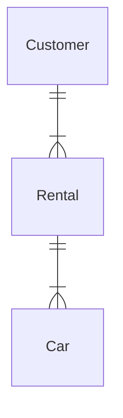
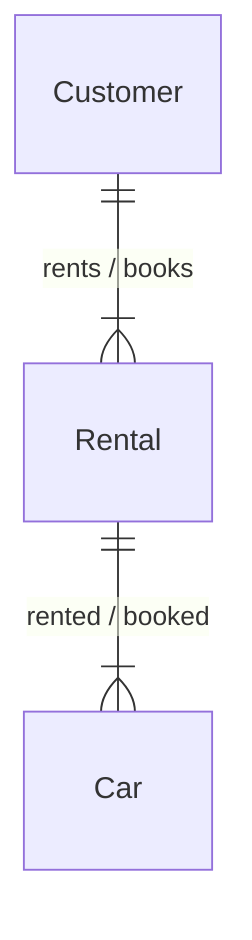

# exercise_0

## exercise_0_3

### Conceptual ERD to words

> This is an ERD conceptual diagram that a database designer and the business stakeholders agreed upon in a car rental company called Carent.

### exercise_0_3_a

a) Describe the entities in this conceptual ERD.

- car
    - each car can be rented by one customer at a time
    - each car can be booked many times by one or more customers
- customer
    - each customer can rent many cars
    - each customer can book many cars
- rental
    - keeps track of current rentals and bookings

### exercise_0_3_b

b) Write out the relationship labels.

### exercise_0_3_c

c) Describe the relationships between the entities (one-to-many, one-to-one and many-to-many).

``Customer - many-to-many - Rental - many-to-many - Car``

### exercise_0_3_d

d) Define the relationship statement for example: "A Customer can have one or more Rentals".

- a customer can rent one or more cars
- a customer can book one or more cars
- a car can be rented by one customer at the time
- a car can be booked by many customers
