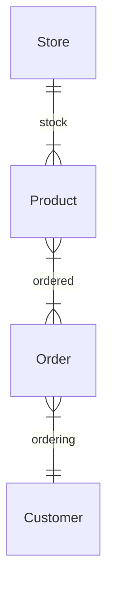

# exercise_0

## exercise_0_4

### Online store

> You are designing a database for an online store that sells multiple products. Customers can place multiple orders, and each order contains multiple products.

### exercise_0_4_a

a) Identify entities and their relationships

> *Online store that sells multiple products*.  
*Customers can place multiple orders*.  
*Each order contains multiple products*.

- store
    - stocks many products
    - takes orders from many customers
- product
    - can be ordered by many customers
- customer
    - can place many orders
    - can order many products
- order
    - is from a single customer
    - contains one or many products 

### exercise_0_4_a

b) Create a conceptual ERD with cardinalities

