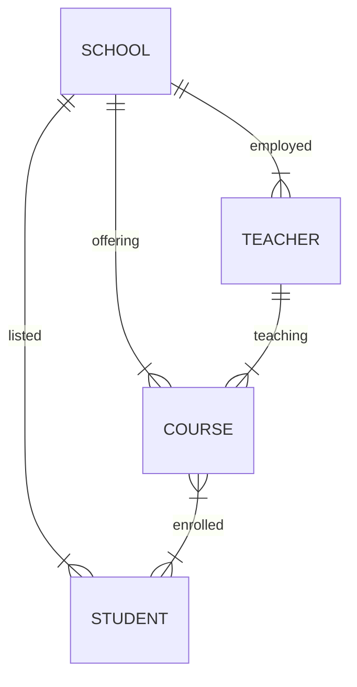

# exercise_0

## exercise_0_5

### University management system

> A university needs a system to manage students, courses, and professors.
>
> - each student can enroll in multiple courses.
> - each course is taught by one professor.
> - a teacher can teach multiple courses.

### exercise_0_5_a

a) Identify entities and their relationships

- teacher
    - can teach many courses
- course
    - taught by one teacher
    - many students can enroll
- student
    - one student can enroll in many courses

### exercise_0_5_b

b) Come up with possible attributes for the entities

- school
    - school_id
    - teachers*
    - courses*
    - students*
- teacher
    - tacher_id
    - school_id
    - courses*
- course
    - course_id
    - school_id
    - teacher_id
    - students*
- student
    - student_id
    - school_id
    - courses*

### exercise_0_5_c

c) Draw conceptual ERD with cardinalities

> See `exercise_0_5.dmbl` ...

### exercise_0_5_d

d) Define business rules (e.g. a student can enroll in max 4 courses)

- teacher can teach max 4 courses
- student can enroll in max 4 courses
- school can offer max 20 courses
- course can have maximum 20 students
