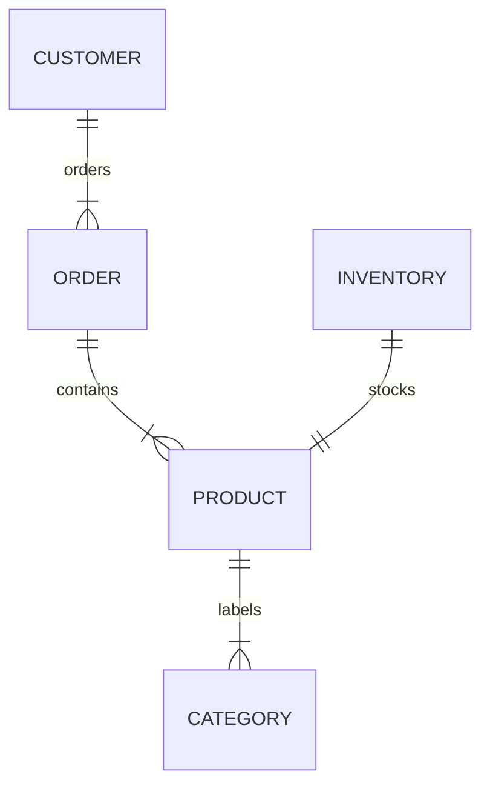
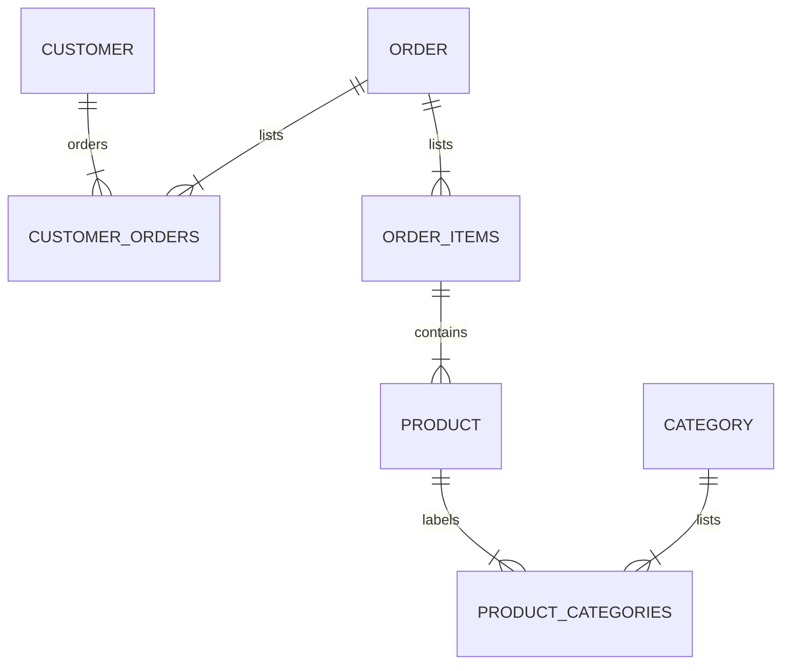

# exercise_0

## exercise_0_6

### Onshop

> An e-commerce platform Onshop manages customers, orders, and products.
>
> - a customer can place multiple orders.
> - each order contains multiple products.
> - a product can belong to multiple categories.

### exercise_0_6_a

a) Identify key entities and their attributes (e.g., customer_name, order_date)

- customer
    - customer_id
    - customer_name
    - customer_address
    - orders*
        - order_id
- order
    - order_id
    - customer_id
    - order_no
    - order_date
    - products*
        - product_id
        - product_order_qty
    - shipping_details
- product
    - product_id
    - product_name
    - categories*
        - category_id
    - product_price
- category
    - category_id
    - category_name

### exercise_0_6_b

b) Sketch the conceptual ERD.

### exercise_0_6_c

c) Define business rules

- A customer can place one or more orders
- An order can contain one or more different products, each in different quantity
- An order can be made by only one customer
- Each category can contain zero or one products
- Each product can be listed in multiple categories
