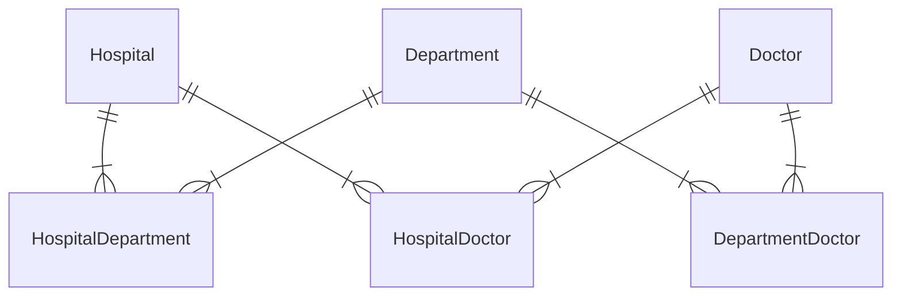
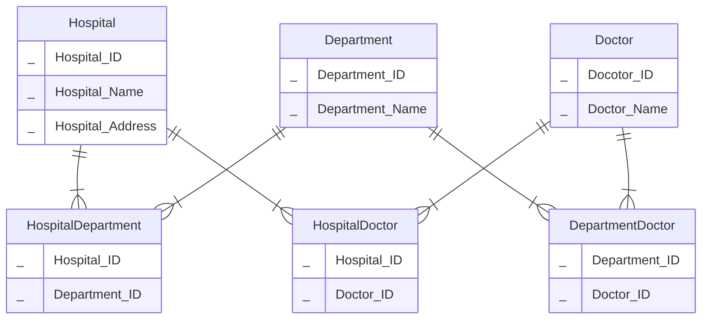
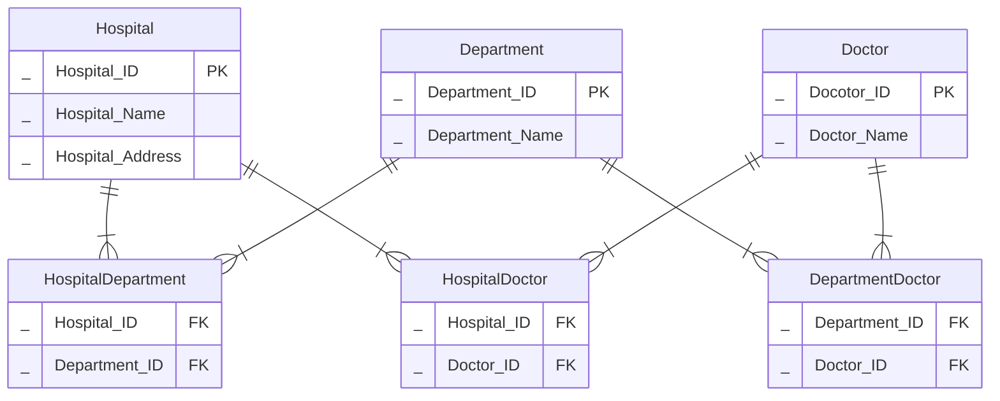

# exercise_1

## exercise_1_0

> Going back to the hospital exercise from exercise0, task 1, we will build logical and physical data models. This is the conceptual data model after we've added the composite entities to take care of many-to-many relationships.



### exercise_0_0_a

a) Create a logical data model using lucidcharts



### exercise_0_0_b

b) Identify different keys on the various entities



### exercise_0_0_c

c) Identify child entities and parent entities. What makes them into parent/child relationships?

...

### exercise_0_0_d

d) Create a physical data model using dbdiagram

> See `exercise_1_0.dmbl` ...

### exercise_0_0_e

e) Create a few tables manually, insert given data plus some more, and try to manually link foreign keys to primary keys.  
Can you satisfy that a doctor can work at *several departments* **and** *several hospitals*?

```sql
CREATE TABLE hospital_doctor (
    hospital_id INTEGER references hospital
    doctor_id INTEGER references doctor
    PRIMARY KEY (hospital_id, doctor_id) -- UNIQUE and NOT NULL
)
```


> See `exercise_1_0.sql ...