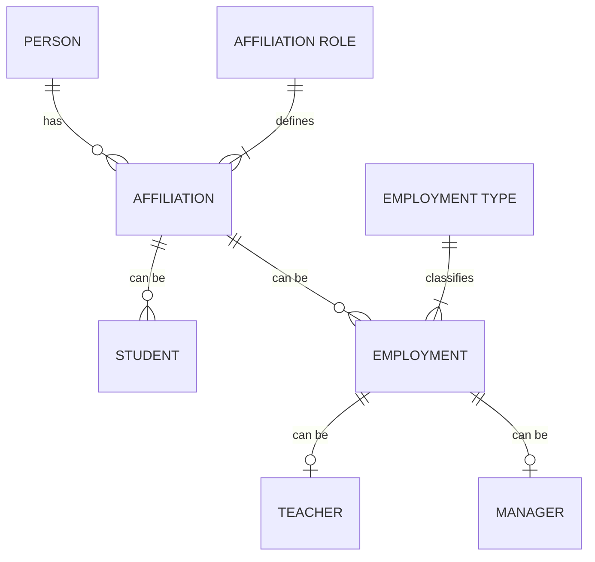
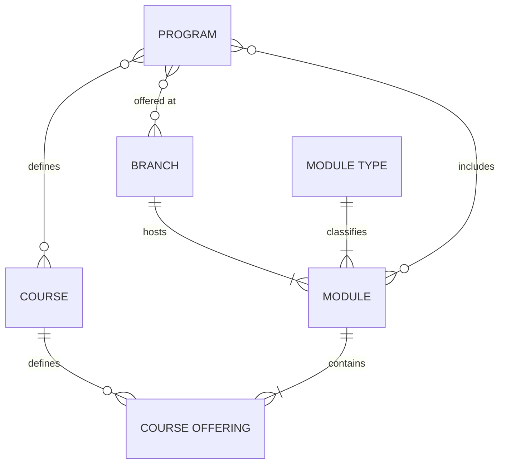
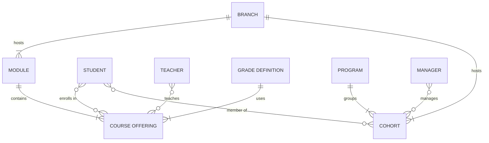
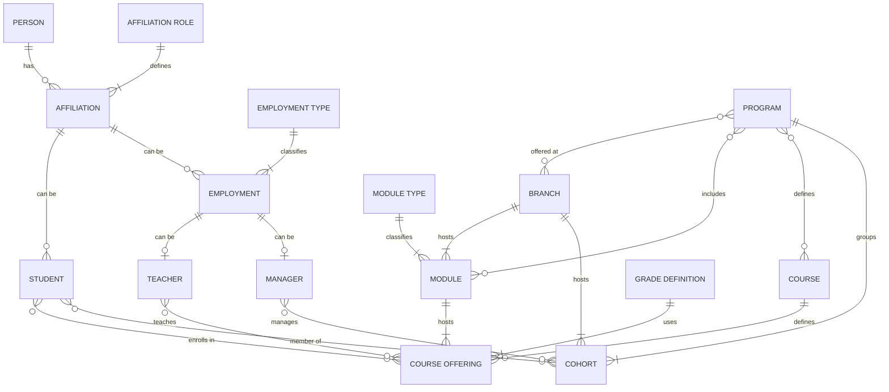

```mermaid
erDiagram
    PERSON ||--o{ AFFILIATION : "has"
    "AFFILIATION ROLE" ||--|{ AFFILIATION : "defines"
    AFFILIATION ||--o{ STUDENT : "can be"
    AFFILIATION ||--o{ EMPLOYMENT : "can be"

    "EMPLOYMENT TYPE" ||--|{ EMPLOYMENT : "classifies"
    EMPLOYMENT ||--o| TEACHER : "can be"
    EMPLOYMENT ||--o| MANAGER : "can be"
```

```mermaid
erDiagram
    PROGRAM }o--o{ BRANCH : "offered at"

    BRANCH ||--|{ MODULE : "hosts"
    "MODULE TYPE" ||--|{ MODULE : "classifies"
    PROGRAM }o--o{ MODULE : "includes"

    PROGRAM }o--o{ COURSE : "defines"
    COURSE ||--o{ "COURSE OFFERING" : "defines"
    MODULE ||--|{ "COURSE OFFERING" : "contains"
```

```mermaid
erDiagram
    BRANCH ||--|{ MODULE : "hosts"
    MODULE ||--|{ "COURSE OFFERING" : "contains"

    STUDENT }o--o{ "COURSE OFFERING" : "enrolls in"
    TEACHER }o--o{ "COURSE OFFERING" : "teaches"
    "GRADE DEFINITION" ||--|{ "COURSE OFFERING" : "uses"

    PROGRAM ||--|{ COHORT : "groups"
    BRANCH ||--|{ COHORT : "hosts"
    STUDENT }o--o{ COHORT : "member of"

    MANAGER }o--o{ COHORT : "manages"
```

---

```mermaid
erDiagram
    PERSON ||--o{ AFFILIATION : "has"
    "AFFILIATION ROLE" ||--|{ AFFILIATION : "defines"
    AFFILIATION ||--o{ STUDENT : "can be"
    AFFILIATION ||--o{ EMPLOYMENT : "can be"

    "EMPLOYMENT TYPE" ||--|{ EMPLOYMENT : "classifies"
    EMPLOYMENT ||--o| TEACHER : "can be"
    EMPLOYMENT ||--o| MANAGER : "can be"

    PROGRAM }o--o{ BRANCH : "offered at"
    BRANCH ||--|{ MODULE : "hosts"
    "MODULE TYPE" ||--|{ MODULE : "classifies"
    PROGRAM }o--o{ MODULE : "includes"

    PROGRAM }o--o{ COURSE : "defines"
    COURSE ||--o{ "COURSE OFFERING" : "defines "
    MODULE ||--|{ "COURSE OFFERING" : "hosts"

    STUDENT }o--o{ "COURSE OFFERING" : "enrolls in"
    TEACHER }o--o{ "COURSE OFFERING" : "teaches"
    "GRADE DEFINITION" ||--|{ "COURSE OFFERING" : "uses"

    PROGRAM ||--|{ COHORT : "groups"
    BRANCH ||--|{ COHORT : "hosts"
    STUDENT }o--o{ COHORT : "member of"
    MANAGER }o--o{ COHORT : "manages"
```