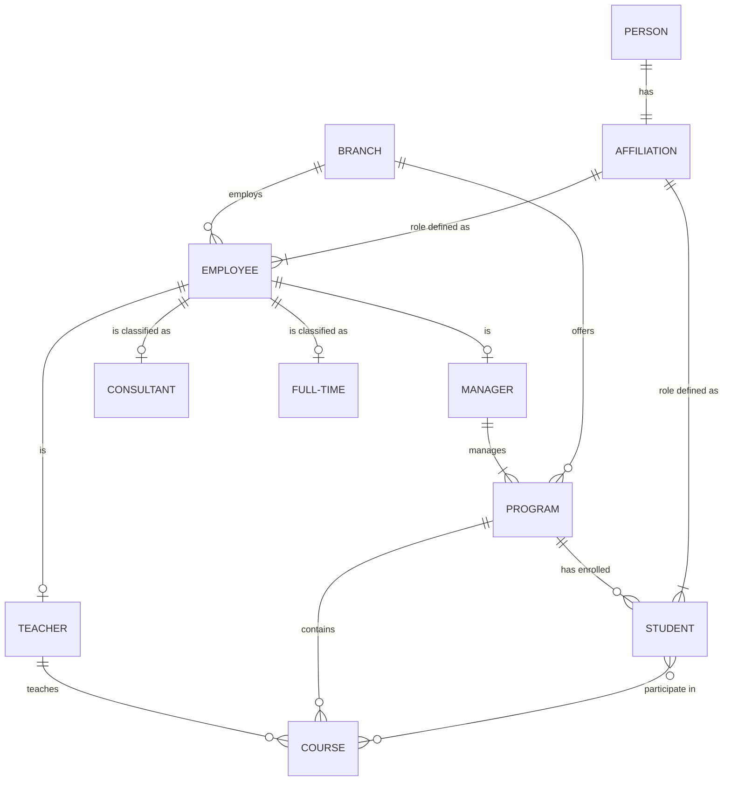

```mermaid
erDiagram
    PERSON      ||--|| AFFILIATION : "has"
    AFFILIATION ||--|{ EMPLOYEE : "role defined as"
    AFFILIATION ||--|{ STUDENT : "role defined as"

    PROGRAM  ||--o{ STUDENT : "has enrolled"
    STUDENT  }o--o{ COURSE : "participate in"

    BRANCH   ||--o{ PROGRAM : "offers"
    PROGRAM  ||--o{ COURSE : "contains"

    BRANCH   ||--o{ EMPLOYEE : "employs"
    EMPLOYEE ||--o| TEACHER : "is"
    EMPLOYEE ||--o| MANAGER : "is"

    EMPLOYEE ||--o| CONSULTANT : "is classified as"
    EMPLOYEE ||--o| FULL-TIME : "is classified as"

    MANAGER  ||--|{ PROGRAM : "manages"
    TEACHER  ||--o{ COURSE : "teaches"
```