## Uppgift 0 - datamodellering

### 0_b

> Gör en konceptuell modell baserat pa kravspecifikationen.

#### Entiteter

Entiterer utifrån beskriven kravspecifikation:

- studenter
    - förnamn
    - efternamn
    - personnummer
    - email
- utbildare
    - personuppgifter
    - anställningsform
        - konsult
        - fast anställd
- utbildningsledare
    - personuppgifter
    - ansvar för 3 klasser
- kurs
    - namn
    - kurskod
    - poäng
    - beskrivning
- program
    - anslutna kurser
    - beviljad omgång/klass
        - totalt/max 3
- fristående kurser
- anläggning
    - ort
- konsult-info
    - företagsnamn
    - organisationsnummer
    - "har F-skatt"
    - address
    - arvode/h
- fast anställd-info
    - personuppgifter
- känsliga uppgifter
    - personuppgifter
        - studenter
        - utbildare
        - utbildningsledare

---

Konceptuella entiteter:

- person-info
    - personuppgifter
        - förnamn
        - efternamn
        - personnummer
        - address
- anställnings-info
    - konsult
        - företag
        - organisationsnummer
        - f-skatt
        - arvode/h
    - fast
        - arbetstid/vecka
        - månadslön
- anställd
    - anläggning
    - person
    - roll
    - anställningsform
        - konsult
        - fast
- utbildningsledare
    - anställd person
    - kurser (<=3)
- utbildare
    - anställd person
    - kurser
- student
    - person
    - program
    - kurser
- program
    - omgång/klass (<=3)
    - kurser
    - start-datum
    - slut-datum
- kurs
    - utbildningsledare
    - utbildare
    - studenter
    - start-datum
    - slut-datum
- anläggning
    - anställda personer
    - program

### Diagram

#### Person to employment role

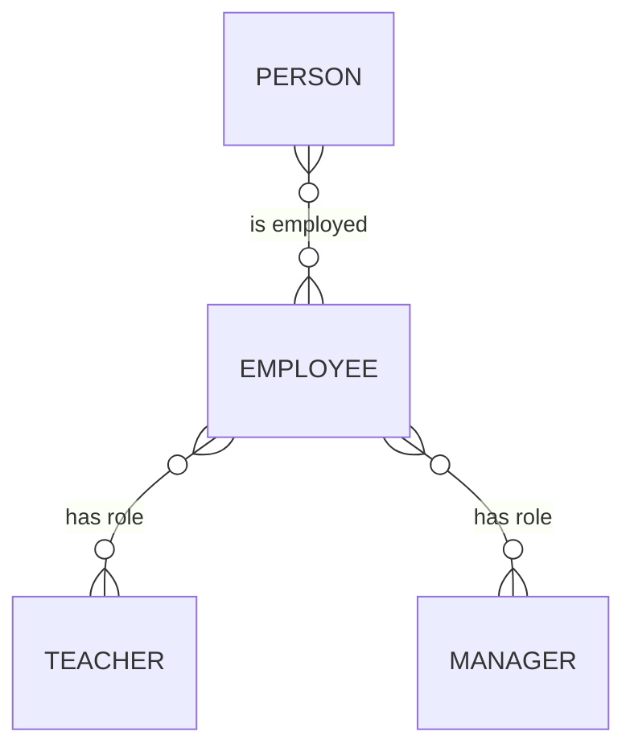

#### Person to student role

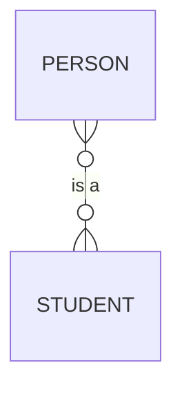

#### Combined

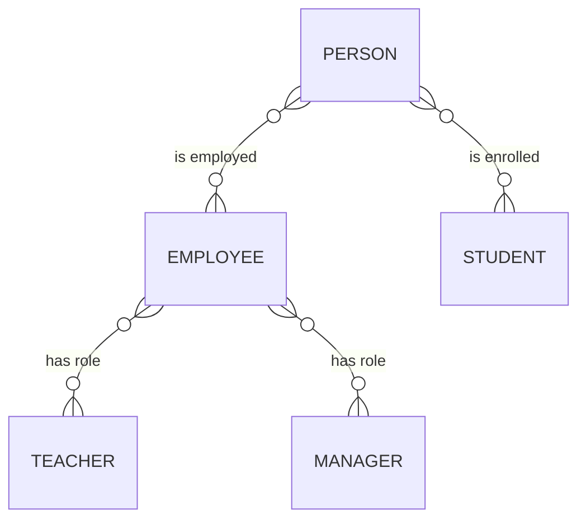

#### With additional employment type

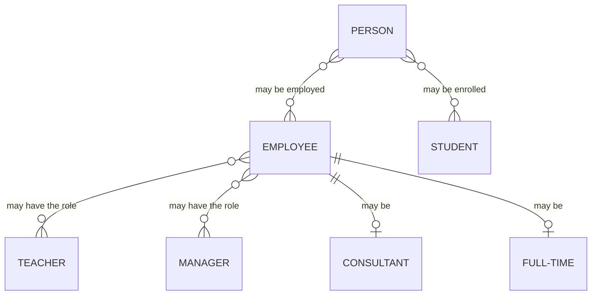

#### With "role"

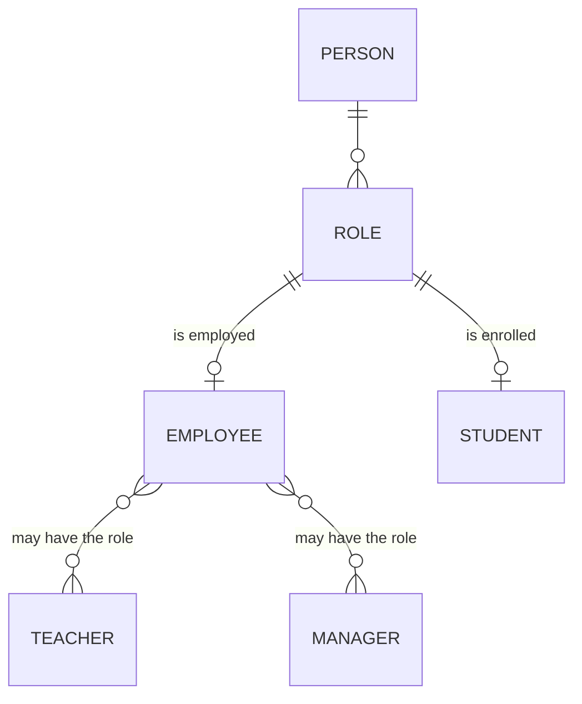

#### With "affiliation" and employment type

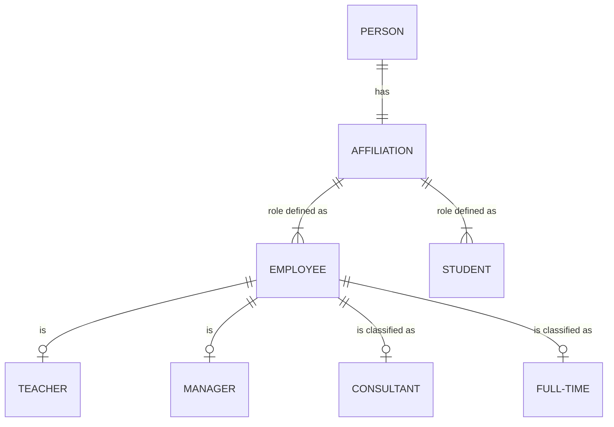

---

#### Branch-level enteties

#### Cardinality

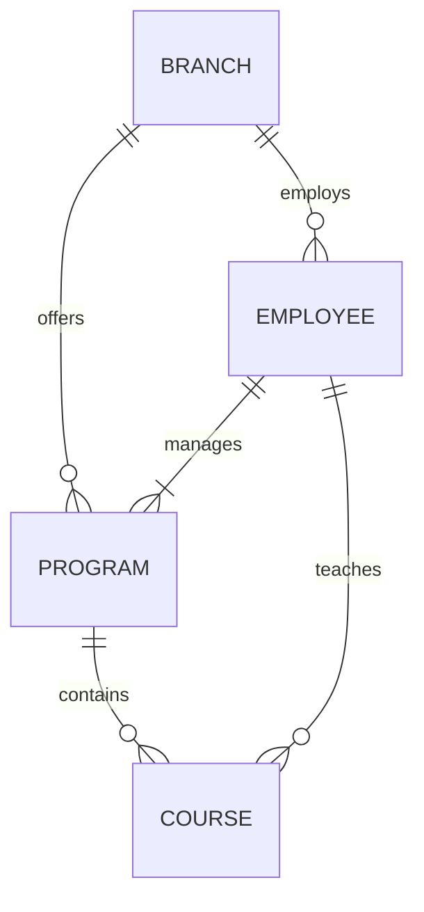

> a branch offers *one or more programs*  
> a program is in *one branch* only  
> (a program *is not* in many branch locations)  
> branch to program  
> *one branch* to *one or more programs*  
> branch *one-to-zero/many* programs  

> *a program* contains *many courses*  
> a course is in exactly *one program*  
> one program *has many* courses  
> program *one-to-zero/many* courses  

> *a branch* employs *many employees*  
> *an employee* is employed to *exactly one branch*  
> *one branch* to *many employees*  
> branch *one-to-zero/many* employees  

> *an employee* can manage *zero or one programs*  
> *one program* can be managed my *one employee* 
> *one program* can not have *zero managers* 
> an employee *one-to-zero/one*  

> *one course* can be run by *one teacher/employee*  
> *one employee/teacher* can teach *many courses*  
> one employee *one-to-zero/many* courses  

#### Adding student

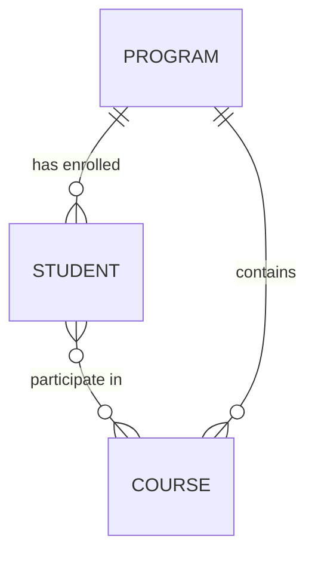
> *one student* can be in only *one program*
> *one prgoram* can have *many students*

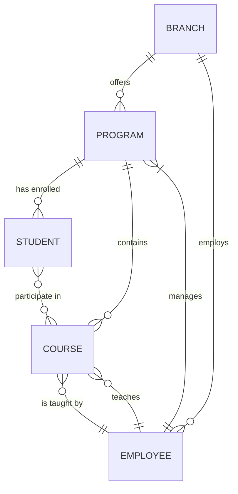

#### Adding teacher/manager
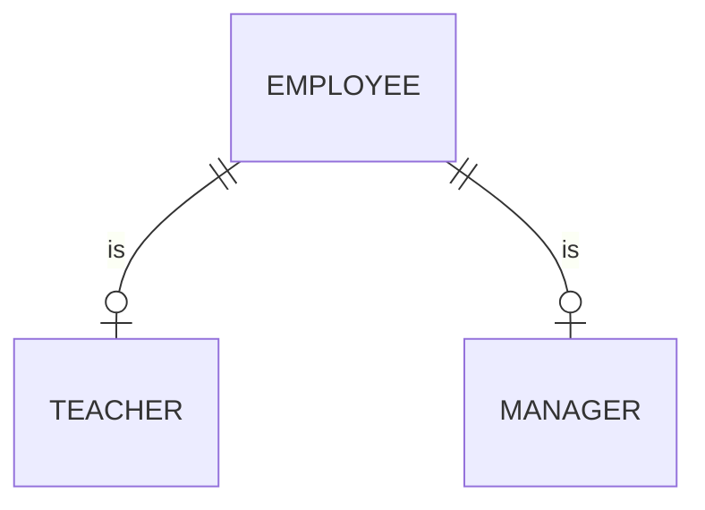

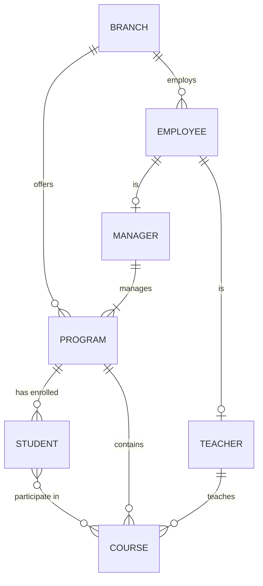

#### Adding affiliation

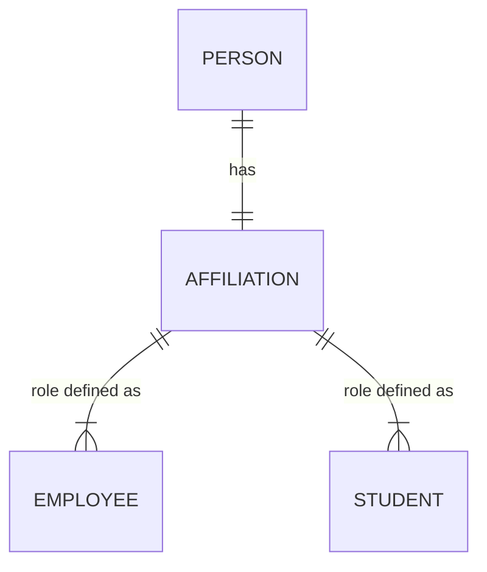

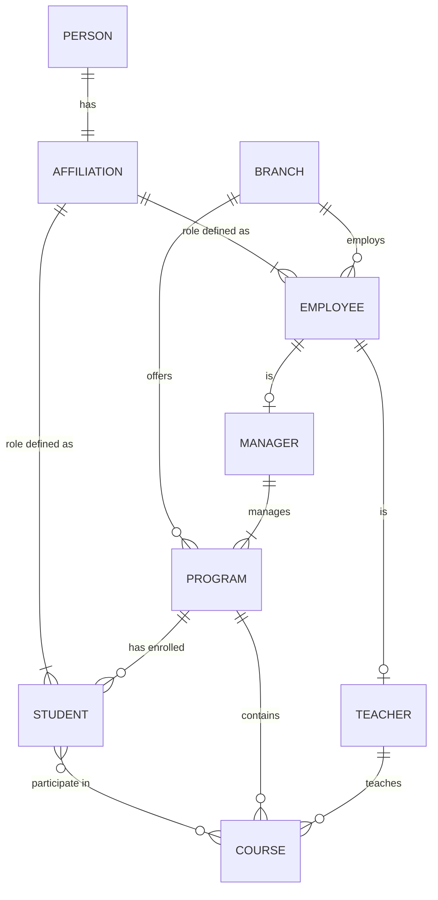

#### Adding employment type

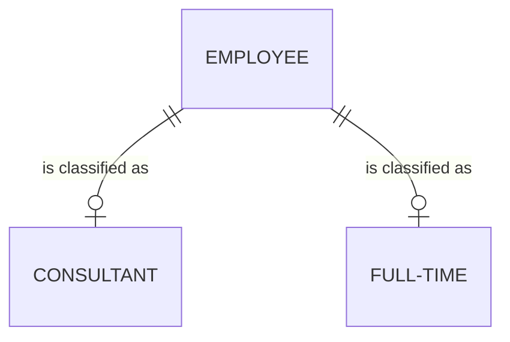

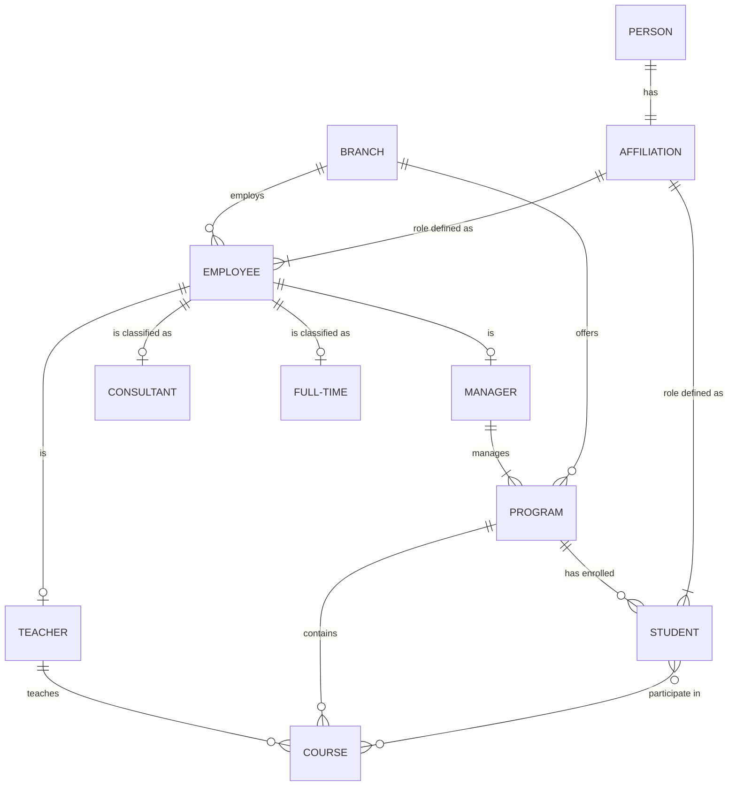

---

#### Beta version

#### Adding course modules

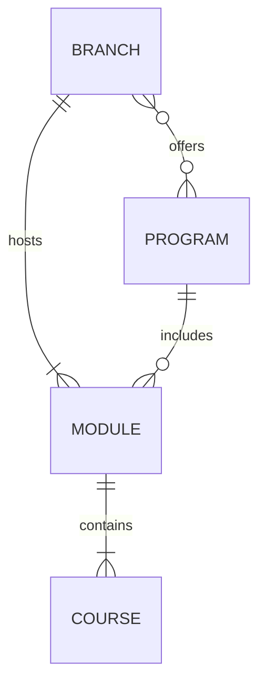
> *one module* can be in only *one branch*  
> *one branch* can have *many modules*  
> *one branch* can have *zero or more programs*  

> *one program* can have *many modules*  
> *one module* can be in *only one program*  

> *one module* contains *one or many courses*  
> *one course* can be in *only one module*  

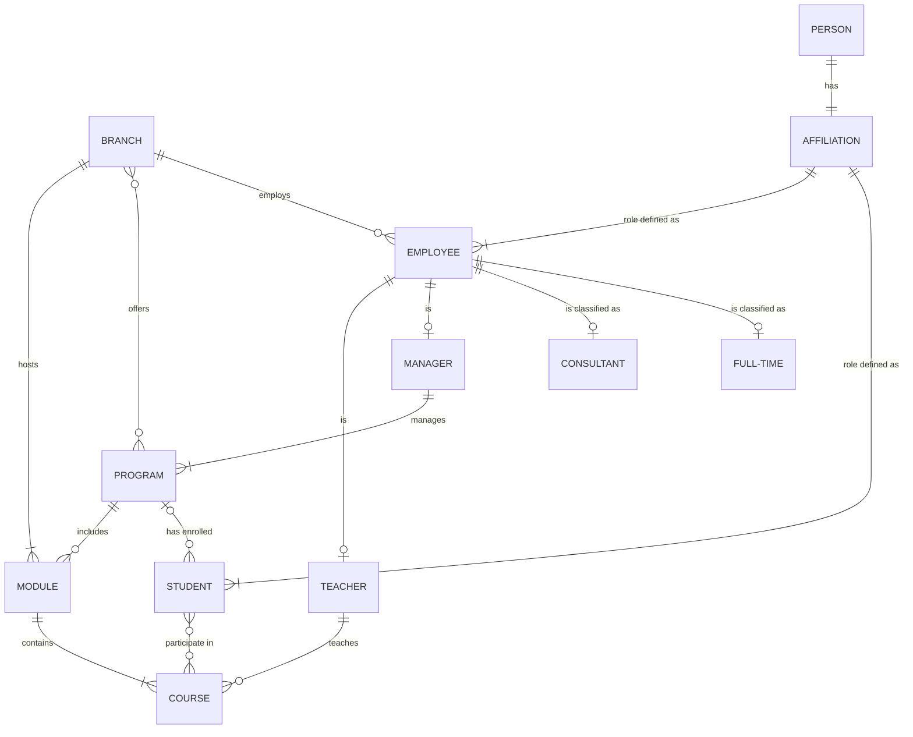