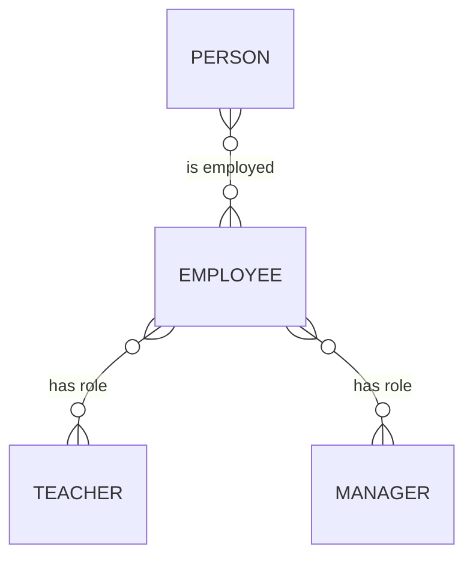
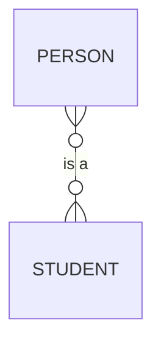
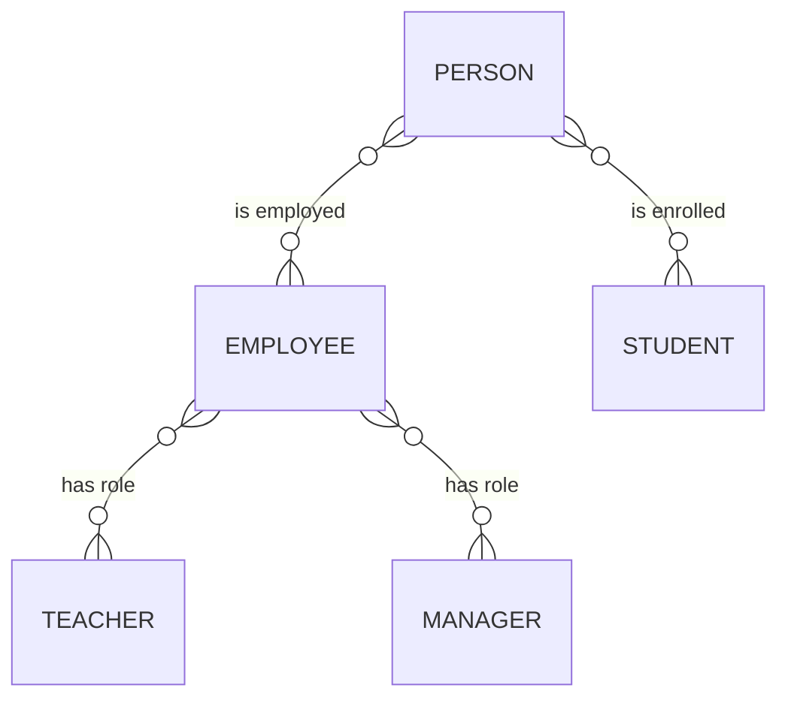
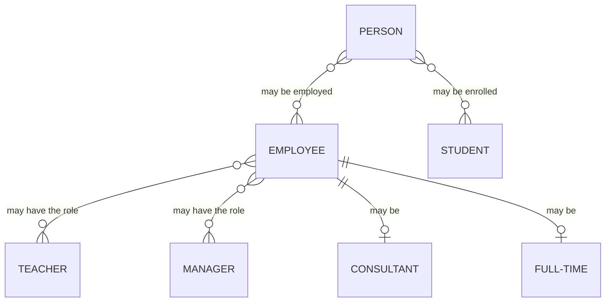
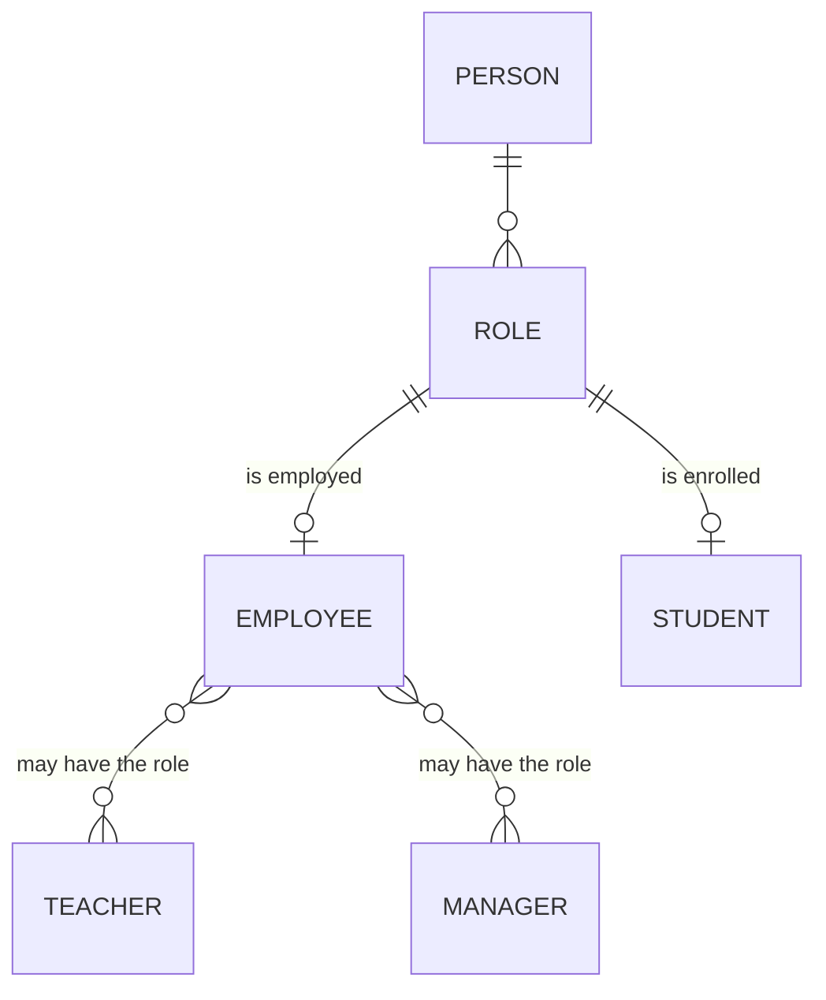
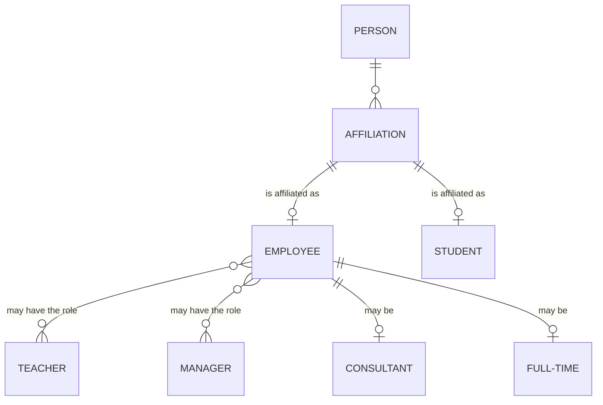

## Uppgift 0 - datamodellering

### 0_b

> Gör en konceptuell modell baserat pa kravspecifikationen.

#### Entiteter

Entiterer utifrån beskriven kravspecifikation:

- studenter
    - förnamn
    - efternamn
    - personnummer
    - email
- utbildare
    - personuppgifter
    - anställningsform
        - konsult
        - fast anställd
- utbildningsledare
    - personuppgifter
    - ansvar för 3 klasser
- kurs
    - namn
    - kurskod
    - poäng
    - beskrivning
- program
    - anslutna kurser
    - beviljad omgång/klass
        - totalt/max 3
- fristående kurser
- anläggning
    - ort
- konsult-info
    - företagsnamn
    - organisationsnummer
    - "har F-skatt"
    - address
    - arvode/h
- fast anställd-info
    - personuppgifter
- känsliga uppgifter
    - personuppgifter
        - studenter
        - utbildare
        - utbildningsledare

---

Konceptuella entiteter:

- person-info
    - personuppgifter
        - förnamn
        - efternamn
        - personnummer
        - address
- anställnings-info
    - konsult
        - företag
        - organisationsnummer
        - f-skatt
        - arvode/h
    - fast
        - arbetstid/vecka
        - månadslön
- anställd
    - anläggning
    - person
    - roll
    - anställningsform
        - konsult
        - fast
- utbildningsledare
    - anställd person
    - kurser (<=3)
- utbildare
    - anställd person
    - kurser
- student
    - person
    - program
    - kurser
- program
    - omgång/klass (<=3)
    - kurser
    - start-datum
    - slut-datum
- kurs
    - utbildningsledare
    - utbildare
    - studenter
    - start-datum
    - slut-datum
- anläggning
    - anställda personer
    - program

### Diagram

#### Person to employment role

#### Person to student role

#### Combined

#### With additional employment type

#### With "role"

#### With "affiliation" and employment type

