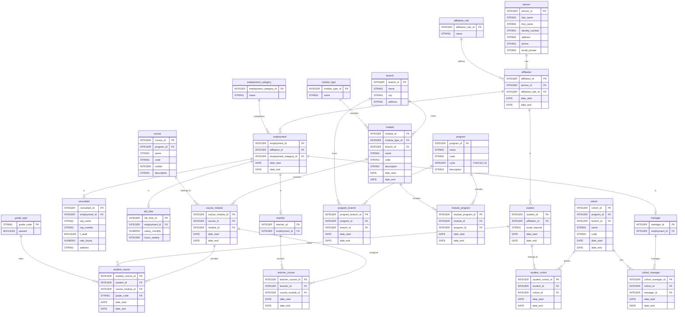

```mermaid
erDiagram
    person ||--o{ affiliation : has
    affiliation_role ||--o{ affiliation : defines
    affiliation ||--o{ student : is
    affiliation ||--o{ employment : is

    employment_category ||--o{ employment   : categorizes
    employment ||--o| consultant : is
    employment ||--o| full_time : is
    employment ||--o| teacher : is
    employment ||--o| manager : is

    program ||--o{ program_branch : includes
    branch ||--o{ program_branch : hosts
    branch ||--o{ module : hosts
    module_type ||--o{ module : classifies
    program ||--o{ module_program : includes
    module ||--o{ module_program : includes
    module ||--o{ course_module : contains
    course ||--o{ course_module : "belongs to"

    course_module ||--o{ student_course : enrolled
    student ||--o{ student_course : takes
    grade_type ||--o{ student_course : rates
    course_module ||--o{ teacher_course : assigned
    teacher ||--o{ teacher_course : teaches

    cohort ||--o{ student_cohort : groups
    student ||--o{ student_cohort : "belongs to"

    manager ||--o{ cohort_manager : manages
    cohort ||--o{ cohort_manager : has

    person {
        INTEGER person_id PK
        STRING last_name
        STRING first_name
        STRING identity_number
        STRING address
        STRING phone
        STRING email_private
    }

    affiliation_role {
        INTEGER affiliation_role_id PK
        STRING name
    }

    affiliation {
        INTEGER affiliation_id PK
        INTEGER person_id FK
        INTEGER affiliation_role_id FK
        DATE date_start
        DATE date_end
    }

    student {
        INTEGER student_id PK
        INTEGER affiliation_id FK
        STRING email_internal
        DATE date_start
        DATE date_end
    }

    employment_category {
        INTEGER employment_category_id PK
        STRING name
    }

    employment {
        INTEGER employment_id PK
        INTEGER affiliation_id FK
        INTEGER employment_category_id FK
        DATE date_start
        DATE date_end
    }

    consultant {
        INTEGER consultant_id PK
        INTEGER employment_id FK
        STRING org_name
        STRING org_number
        BOOLEAN f_skatt
        NUMERIC rate_hourly
        STRING address
    }

    full_time {
        INTEGER full_time_id PK
        INTEGER employment_id FK
        NUMERIC salary_monthly
        INTEGER hours_weekly
    }

    teacher {
        INTEGER teacher_id PK
        INTEGER employment_id FK
    }

    manager {
        INTEGER manager_id PK
        INTEGER employment_id FK
    }

    branch {
        INTEGER branch_id PK
        STRING name
        STRING city
        STRING address
    }

    program {
        INTEGER program_id PK
        STRING name
        STRING code
        INTEGER cycle "CHECK(1-3)"
        STRING description
    }

    program_branch {
        INTEGER program_branch_id PK
        INTEGER program_id FK
        INTEGER branch_id FK
        DATE date_start
        DATE date_end
    }

    module_type {
        INTEGER module_type_id PK
        STRING name
    }

    module {
        INTEGER module_id PK
        INTEGER module_type_id FK
        INTEGER branch_id FK
        STRING name
        STRING code
        STRING description
        DATE date_start
        DATE date_end
    }

    module_program {
        INTEGER module_program_id PK
        INTEGER module_id FK
        INTEGER program_id FK
        DATE date_start
        DATE date_end
    }

    course {
        INTEGER course_id PK
        INTEGER program_id FK
        STRING name
        STRING code
        INTEGER credits
        STRING description
    }

    course_module {
        INTEGER course_module_id PK
        INTEGER course_id FK
        INTEGER module_id FK
        DATE date_start
        DATE date_end
    }

    teacher_course {
        INTEGER teacher_course_id PK
        INTEGER teacher_id FK
        INTEGER course_module_id FK
        DATE date_start
        DATE date_end
    }

    student_course {
        INTEGER student_course_id PK
        INTEGER student_id FK
        INTEGER course_module_id FK
        STRING grade_code FK
        DATE date_start
        DATE date_end
    }

    grade_type {
      STRING grade_code PK
      BOOLEAN passed
    }

    cohort {
        INTEGER cohort_id PK
        INTEGER program_id FK
        INTEGER branch_id FK
        STRING name
        STRING code
        DATE date_start
        DATE date_end
    }

    student_cohort {
        INTEGER student_cohort_id PK
        INTEGER student_id FK
        INTEGER cohort_id FK
        DATE date_start
        DATE date_end
    }

    cohort_manager {
        INTEGER cohort_manager_id PK
        INTEGER cohort_id FK
        INTEGER manager_id FK
        DATE date_start
        DATE date_end
    }
```