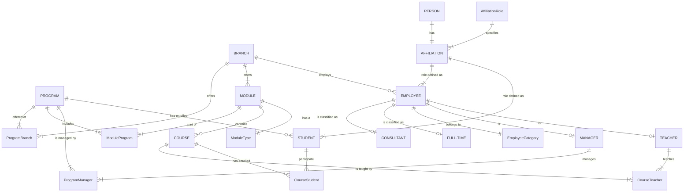

```mermaid
erDiagram
    PROGRAM ||--|{ ProgramBranch : "offered at"
    BRANCH  ||--|{ ProgramBranch : "offers"

    BRANCH  ||--|{ MODULE : "offers"
    MODULE  ||--|{ ModuleProgram : "part of"
    PROGRAM ||--|{ ModuleProgram : "includes"
    MODULE  ||--o{ COURSE : "contains"
    MODULE  ||--|| ModuleType : "has a"

    PERSON      ||--|| AFFILIATION : "has"
    AFFILIATION ||--|{ EMPLOYEE : "role defined as"
    AFFILIATION ||--|{ STUDENT : "role defined as"
    AffiliationRole ||--|{ AFFILIATION : "specifies"

    BRANCH   ||--o{ EMPLOYEE : "employs"
    EMPLOYEE ||--o| CONSULTANT : "is classified as"
    EMPLOYEE ||--o| FULL-TIME : "is classified as"
    EMPLOYEE ||--|| EmployeeCategory : "belongs to"

    EMPLOYEE ||--o| MANAGER : "is"
    PROGRAM  ||--|{ ProgramManager : "is managed by"
    MANAGER  ||--|{ ProgramManager : "manages"

    EMPLOYEE ||--o| TEACHER : "is"
    COURSE   ||--|{ CourseTeacher : "is taught by"
    TEACHER  ||--|{ CourseTeacher : "teaches"

    PROGRAM ||--o{ STUDENT : "has enrolled"
    COURSE  ||--|{ CourseStudent : "has enrolled"
    STUDENT ||--|{ CourseStudent : "participate"
```