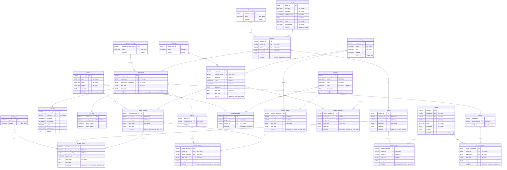

```mermaid
erDiagram
    person ||--o{ affiliation : has
    affiliation_role ||--o{ affiliation : defines
    affiliation ||--o{ student : is
    affiliation ||--o{ employment : is

    employment_category ||--o{ employment   : categorizes
    employment ||--o| consultant : is
    employment ||--o| full_time : is
    employment ||--o| teacher : is
    employment ||--o| manager : is

    program }o--o{ program_course : "contains"
    course  }o--o{ program_course : "part of"
    program ||--o{ program_branch : includes
    branch ||--o{ program_branch : hosts
    branch ||--o{ module : hosts
    module_type ||--o{ module : classifies
    program ||--o{ module_program : includes
    module ||--o{ module_program : includes
    module ||--o{ course_module : contains
    course ||--o{ course_module : "belongs to"

    course_module ||--o{ student_course : enrolled
    student ||--o{ student_course : takes
    grade_type ||--o{ student_course : rates
    course_module ||--o{ teacher_course : assigned
    teacher ||--o{ teacher_course : teaches

    cohort ||--o{ student_cohort : groups
    student ||--o{ student_cohort : "belongs to"

    manager ||--o{ cohort_manager : manages
    cohort ||--o{ cohort_manager : has

    person {
        BIGINT person_id PK
        VARCHAR last_name "NOT NULL"
        VARCHAR first_name "NOT NULL"
        VARCHAR identity_number "NOT NULL"
        TEXT address "NOT NULL"
        VARCHAR phone "NOT NULL"
        VARCHAR email_private "NOT NULL"
        _ UNIQUE "(identity_number)"
    }

    affiliation_role {
        BIGINT affiliation_role_id PK
        VARCHAR name "NOT NULL"
        _ UNIQUE "(name)"
    }

    affiliation {
        BIGINT affiliation_id PK
        BIGINT person_id FK "NOT NULL"
        BIGINT affiliation_role_id FK "NOT NULL"
        DATE date_start "NOT NULL"
        DATE date_end
        _ UNIQUE "(person_id, affiliation_role_id)"
    }

    student {
        BIGINT student_id PK
        BIGINT affiliation_id FK "NOT NULL"
        VARCHAR email_internal "NOT NULL"
        DATE date_start "NOT NULL"
        DATE date_end
        _ UNIQUE "(affiliation_id, email_internal)"
    }

    employment_category {
        BIGINT employment_category_id PK
        VARCHAR name "NOT NULL"
        _ UNIQUE "(name)"
    }

    employment {
        BIGINT employment_id PK
        BIGINT affiliation_id FK "NOT NULL"
        BIGINT employment_category_id FK "NOT NULL"
        DATE date_start "NOT NULL"
        DATE date_end
        _ UNIQUE "(affiliation_id, employment_category_id, date_start)"
    }

    consultant {
        BIGINT consultant_id PK
        BIGINT employment_id FK "NOT NULL"
        VARCHAR org_name
        VARCHAR org_number
        BOOLEAN f_skatt
        NUMERIC rate_hourly
        TEXT address
    }

    full_time {
        BIGINT full_time_id PK
        BIGINT employment_id FK "NOT NULL"
        NUMERIC salary_monthly
        SMALLINT hours_weekly
    }

    teacher {
        BIGINT teacher_id PK
        BIGINT employment_id FK "NOT NULL"
        _ UNIQUE "(employment_id)"
    }

    manager {
        BIGINT manager_id PK
        BIGINT employment_id FK "NOT NULL"
        _ UNIQUE "(employment_id)"
    }

    branch {
        BIGINT branch_id PK
        VARCHAR name "NOT NULL"
        VARCHAR city "NOT NULL"
        VARCHAR address
        _ UNIQUE "(name, city)"
    }

    program {
        BIGINT program_id PK
        VARCHAR name "NOT NULL"
        VARCHAR code "NOT NULL"
        SMALLINT cycle "NOT NULL, CHECK(1-3)"
        TEXT description
        _ UNIQUE "(code, cycle)"
    }

    program_branch {
        BIGINT program_branch_id PK
        BIGINT program_id FK "NOT NULL"
        BIGINT branch_id FK "NOT NULL"
        DATE date_start "NOT NULL"
        DATE date_end
        _ UNIQUE "(program_id, branch_id, date_start)"
    }

    module_type {
        BIGINT module_type_id PK
        VARCHAR name "NOT NULL"
        _ UNIQUE "(name)"
    }

    module {
        BIGINT module_id PK
        BIGINT module_type_id FK "NOT NULL"
        BIGINT branch_id FK "NOT NULL"
        VARCHAR name "NOT NULL"
        VARCHAR code "NOT NULL"
        TEXT description
        DATE date_start "NOT NULL"
        DATE date_end
        _ UNIQUE "(branch_id, code, date_start)"
    }

    module_program {
        BIGINT module_program_id PK
        BIGINT module_id FK "NOT NULL"
        BIGINT program_id FK "NOT NULL"
        DATE date_start "NOT NULL"
        DATE date_end
        _ UNIQUE "(module_id, program_id, date_start)"
    }

    course {
        BIGINT course_id PK
        VARCHAR name "NOT NULL"
        VARCHAR code "NOT NULL"
        SMALLINT credits "NOT NULL"
        TEXT description
        _ UNIQUE "(program_id, code)"
    }

    course_module {
        BIGINT course_module_id PK
        BIGINT course_id FK "NOT NULL"
        BIGINT module_id FK "NOT NULL"
        DATE date_start "NOT NULL"
        DATE date_end
        _ UNIQUE "(course_id, module_id, date_start)"
    }

    teacher_course {
        BIGINT teacher_course_id PK
        BIGINT teacher_id FK "NOT NULL"
        BIGINT course_module_id FK "NOT NULL"
        DATE date_start "NOT NULL"
        DATE date_end
        _ UNIQUE "(teacher_id, course_module_id, date_start)"
    }

    program_course {
        BIGINT program_course_id PK
        BIGINT program_id FK "NOT NULL"
        BIGINT course_id FK "NOT NULL"
        _ UNIQUE "(program_id, course_id)"
    }

    student_course {
        BIGINT student_course_id PK
        BIGINT student_id FK "NOT NULL"
        BIGINT course_module_id FK "NOT NULL"
        VARCHAR grade_code FK
        DATE date_start "NOT NULL"
        DATE date_end
        _ UNIQUE "(student_id, course_module_id, date_start)"
    }

    grade_type {
      VARCHAR grade_code PK
      BOOLEAN passed "NOT NULL"
    }

    cohort {
        BIGINT cohort_id PK
        BIGINT program_id FK "NOT NULL"
        BIGINT branch_id FK "NOT NULL"
        VARCHAR name "NOT NULL"
        VARCHAR code "NOT NULL"
        DATE date_start "NOT NULL"
        DATE date_end
        _ UNIQUE "(program_id, code, date_start)"
    }

    student_cohort {
        BIGINT student_cohort_id PK
        BIGINT student_id FK "NOT NULL"
        BIGINT cohort_id FK "NOT NULL"
        DATE date_start "NOT NULL"
        DATE date_end
        _ UNIQUE "(student_id, cohort_id, date_start)"
    }

    cohort_manager {
        BIGINT cohort_manager_id PK
        BIGINT cohort_id FK "NOT NULL"
        BIGINT manager_id FK "NOT NULL"
        DATE date_start "NOT NULL"
        DATE date_end
        _ UNIQUE "(cohort_id, manager_id, date_start)"
    }
```